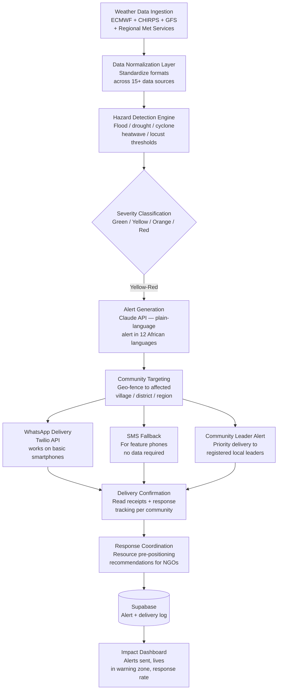

<p align="center">
  <h1 align="center">mama-disaster-response</h1>
  <h3 align="center"><em>Africa Early Warning System. Weather ingestion, alert generation, WhatsApp delivery.</em></h3>
</p>

<p align="center">
  <a href="LICENSE"></a>
  
  
  <a href="https://mama.oliwoods.ai"></a>
  <a href="https://mama.oliwoods.ai/foundation"></a>
</p>

---

---

## Status / Honesty

This repository is a **prototype library** under the Mama Foundation (Scheme C). It is **not** production clinical software, **not** HIPAA certified, and **not** cleared for care delivery.

- Maturity: **Prototype**
- Portal path: [https://mama.oliwoods.ai/foundation/disaster-response](https://mama.oliwoods.ai/foundation/disaster-response)
- See [MAMA-MSTR#959](https://github.com/OliWoods-Org/MAMA-MSTR/issues/959)


> *"Less than 40% of people in Africa have access to early warning systems for extreme weather. In 2023 alone, floods in East and West Africa killed thousands of people who had no advance warning. The technology to save them exists. It just wasn't pointed at them."*
> — WMO State of Climate in Africa, 2023

## Why This Exists

Early warning systems save lives — but only if people receive the warning. In sub-Saharan Africa, where smartphone penetration averages 34% and grid power is unreliable, standard push-notification disaster systems reach almost no one. WhatsApp, however, reaches 500 million people across the continent. This system is built around that reality.

- **Less than 40%** of Africans have access to early warning systems for extreme weather events (WMO, 2023)
- **Africa faces 5x more climate disasters** per capita than other regions, yet receives less than 3% of global climate adaptation funding (UNEP, 2023)
- **2,000+ deaths** from preventable flood and drought events in East Africa in 2023 alone, most in communities with no warning infrastructure (ReliefWeb)
- **WhatsApp penetration** in sub-Saharan Africa exceeds 70% in urban areas and 40% in rural areas — making it the highest-reach alert channel on the continent

This system turns weather data into WhatsApp messages in local languages, before the flood arrives.

## System Architecture



## Features

| Feature | Description | Data Source |
|---------|-------------|-------------|
| **Multi-Source Weather Ingestion** | ECMWF, CHIRPS, GFS, and 12 African national meteorological services aggregated | 15+ real-time feeds |
| **Hazard Detection Engine** | Threshold-based detection for floods, drought, cyclones, heatwaves, and locust swarms | WMO + FAO thresholds |
| **12-Language Alert Generation** | AI generates plain-language alerts in Swahili, Hausa, Amharic, Zulu, French, Arabic, and more | Claude API |
| **WhatsApp-First Delivery** | Alerts delivered via WhatsApp to any smartphone; SMS fallback for feature phones | Twilio API |
| **Community Leader Network** | Registered local leaders receive priority alerts with guidance for community mobilization | Ground-truth network |
| **Geo-Fenced Targeting** | Village, district, and regional precision — no false alarms for unaffected areas | PostGIS |
| **NGO Resource Coordination** | Automated recommendations for pre-positioning food, medical, and shelter resources | OCHA ReliefWeb API |
| **Impact Dashboard** | Real-time tracking of alerts sent, communities warned, response rates, and outcome data | Supabase analytics |

## Research Foundation

| Citation | Finding | Relevance |
|----------|---------|-----------|
| WMO (2023) | < 40% of Africans have early warning access; 5x more climate disasters per capita | Core mission driver |
| UNDRR (2022) | Early warning systems reduce disaster mortality by up to 30x when they reach affected populations | Impact justification |
| GSMA (2023) | WhatsApp penetration > 70% in urban SSA; highest-reach communication channel | Delivery architecture |
| ReliefWeb (2023) | 2,000+ preventable flood deaths in East Africa in 2023 in no-warning communities | Urgency evidence |

## Quick Start

```bash
git clone https://github.com/OliWoods-Org/mama-disaster-response.git
cd mama-disaster-response
npm install
npm run dev
```

## Tech Stack

- **Runtime:** Node.js + TypeScript
- **Validation:** Zod schemas
- **Database:** Supabase (PostgreSQL + PostGIS for geospatial)
- **AI:** Claude API (multilingual alert generation, hazard classification)
- **Weather:** ECMWF API, CHIRPS, GFS, Open-Meteo
- **Alerts:** Twilio WhatsApp Business API + SMS fallback
- **Mapping:** Mapbox GL with GeoJSON hazard overlays

## Contributing

We actively seek contributions from African meteorologists, disaster response NGO staff, multilingual developers (especially Swahili, Hausa, Amharic, Zulu, French), and geospatial engineers. Ground-truth knowledge from affected regions is irreplaceable.

1. Fork the repo
2. Create a feature branch (`git checkout -b feat/amazing-feature`)
3. Commit your changes
4. Push and open a PR

## License

AGPL-3.0 — Free to use, modify, and distribute.

---

<p align="center">
  <strong>Built by the <a href="https://oliwoods.ai">OliWoods Foundation</a></strong><br>
  <em>Free forever. Open source. Because the technology to save lives already exists — it just needs to reach the right people first.</em>
</p>
